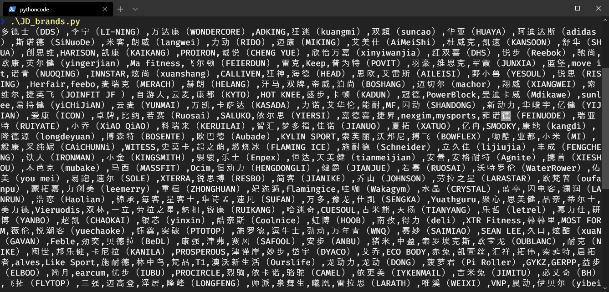
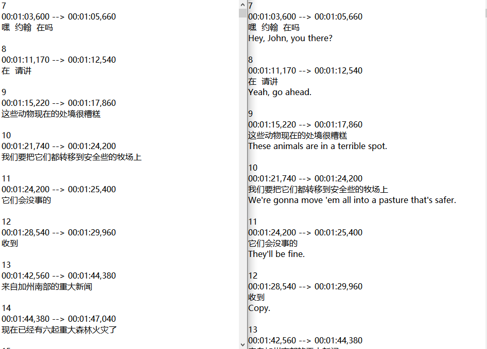

# Python随便写的小工具

**JD_brands.py** -- 用商品类别或商品名称做关键字，爬取京东对应的所有品牌，直接用正则解析的

**remove_nonchinese_sub.py** -- 去除Srt字幕文件中非中文字幕

**注意：文件名中不能有空格**

直接把srt字幕文件拖到命令行内回车，自动识别并转换编码格式为UTF-8，在字幕文件所在目录下生成一个去掉非中文字幕的srt字幕文件，文件名后面追加了 "_out"

